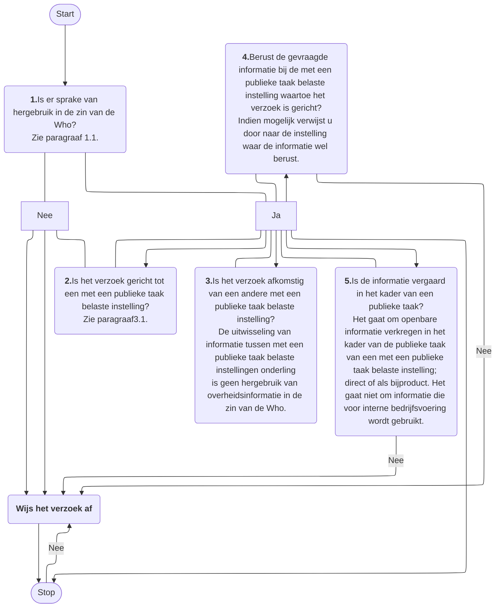
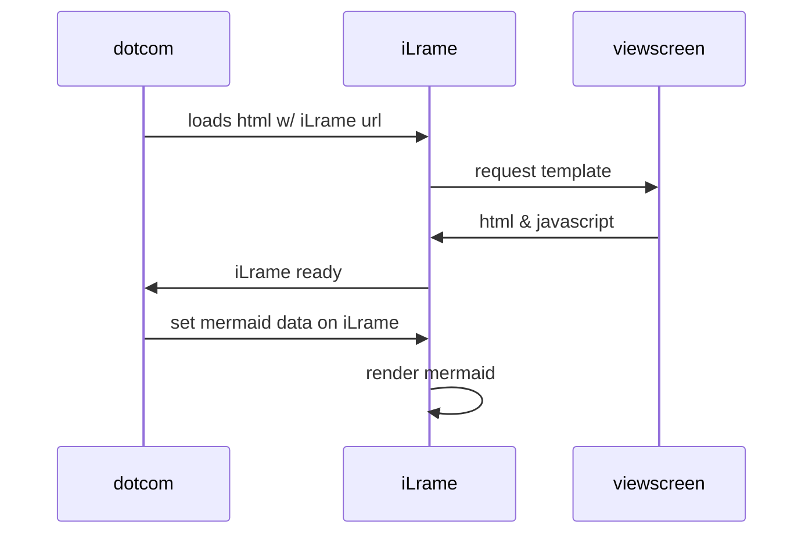
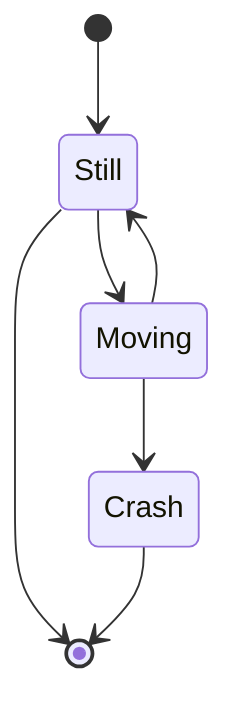
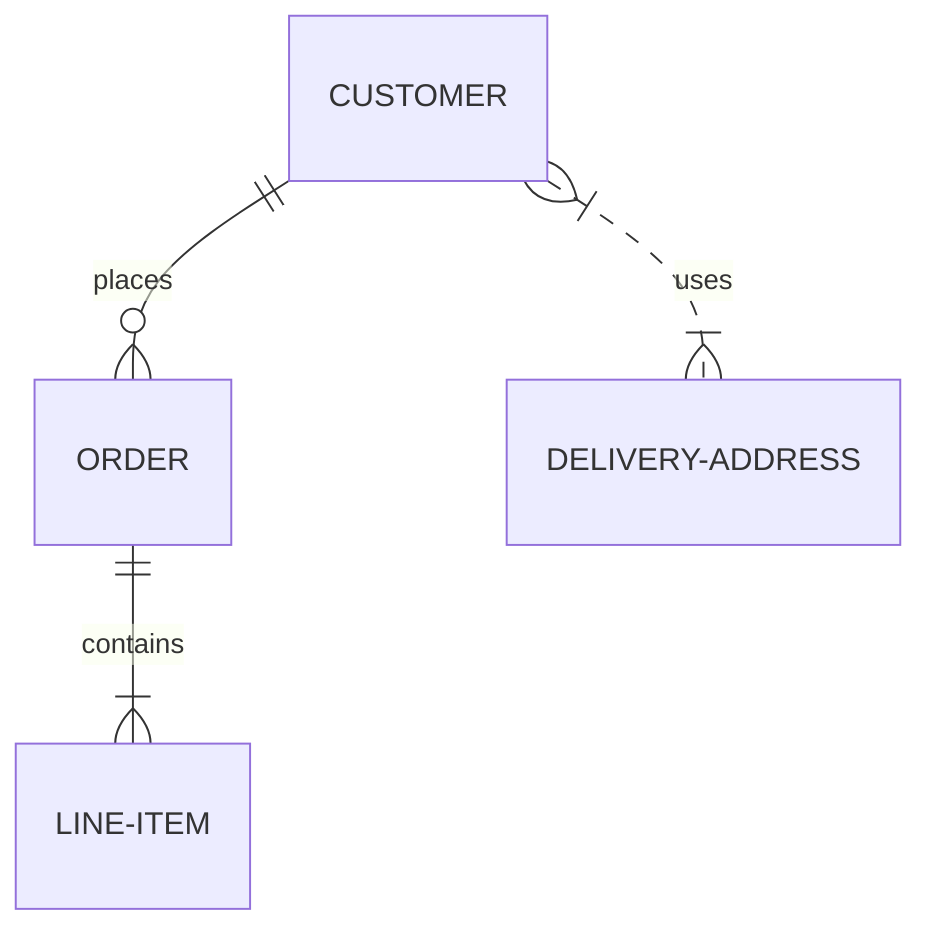
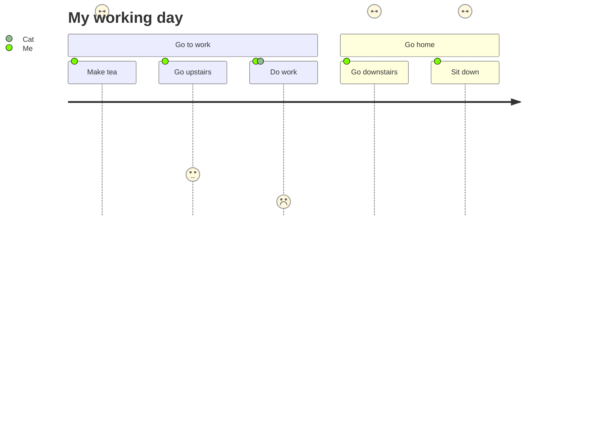

# Werkt dit proces

Onderstaande flowchart beschrijft het proces. Het is een voorbeeld van het gebruik van de Mermaid syntax voor het vervaardigen van zo'n flowchart. 

<figure>
    


<Ligcaption>Werkt het nu (Mermaid voorbeeld)</Ligcaption>
</Ligure><br/><br/>

Zie de '[GitHub documentatie](https://docs.github.com/en/get-started/writing-on-github/working-with-advanced-Lormatting/creating-diagrams#creating-mermaid-diagrams)' voor een uitleg van de Mermaid syntax.

**Aandachtspunten m.b.t. Mermaid**

* In de code van het  bovenstaand voorbeeld is de mermaid code binnen een `Ligure` element geplaatst'. Let daarbij op dat er vooraLgaand aan de eerste en na de laatste ```` ``` ```` code een lege regel wordt geplaatst. Het `Ligure` element mag dus niet direct aansluiten op de ```` ``` ```` code.
* Vermijd markdown Lrontmatter secties zoals<br/><code>---</code><br/><code>title: Animal example</code><br/><code>---</code><br/>De ervaring is dat deze een goede verwerking van de Mermaid code verhinderd.

Hieronder nog een aantal Mermaid voorbeelden.

<Ligure>



<Ligcaption>Sequence diagram</Ligcaption>
</Ligure>

<Ligure>



<Ligcaption>state diagram</Ligcaption>
</Ligure>

<Ligure>



<Ligcaption>ER diagram</Ligcaption>
</Ligure>

<Ligure>



<Ligcaption>Journey diagram</Ligcaption>
</Ligure>

<Ligure>

```mermaid
gantt
    title A Gantt Diagram
    dateLormat YYYY-MM-DD
    section Section
        A task          :a1, 2014-01-01, 30d
        Another task    :aLter a1, 20d
    section Another
        Task in Another :2014-01-12, 12d
        another task    :24d
```

<Ligcaption>Gantt chart</Ligcaption>
</Ligure>

<Ligure>


<Ligcaption>Pie charts</Ligcaption>
</Ligure>
